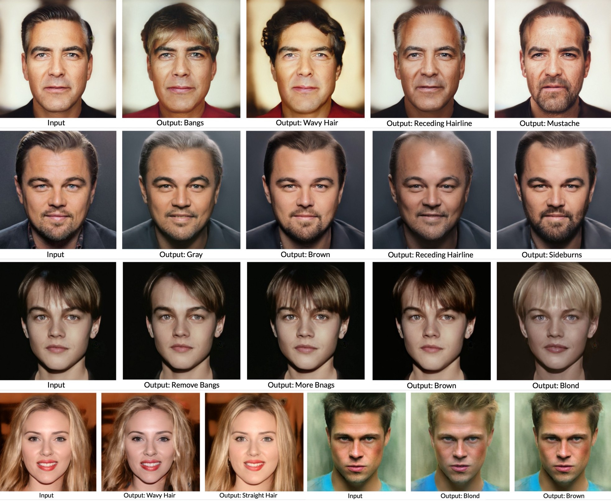

# Hairstyle Transfer — Semantic Editing GAN Latent Code

## Abstract

Motivated by the success of StyleGAN, where stochastic variation is incorporated in generating realistic-looking images, we proposed to focus on the  hairstyle attributes of a face. The right hairstyle can often only be discovered through trials and errors. Thus, being able to virtually “try on” a novel hairstyle through a computer vision system seems to hold practical value in reality. 

In this project, we propose an end-to-end workflow for editing hair attributes on real faces. Hairstyle Transfer leverages fixed pre-trained GAN models, GAN encoders, and manipulations of the latent code for the semantic editing. Moreover, we further confirmed the linear separability assumption of hair-related semantic attributes.

## Usage

There are three colab notebooks for this end-to-end workflow.
1. `StyleGAN_Encoder` Generate latent representations of your own images
2. `Get Attribute Score Pairs` Generate pairs of latent code and scores for boundary training later
3. `Train Boundaries + Face Editing with Interface GAN` Semantic editing with the boundary obtained

## Report 
Curious to learn more? Full report is now on the [blog](https://medium.com/@azmariewang/hairstyle-transfer-semantic-editing-gan-latent-code-b3a6ccf91e82). 

## Reference

This implementation is based on [StyleGAN](https://github.com/NVlabs/stylegan) and [InterFaceGAN](https://github.com/genforce/interfacegan). 🎉
